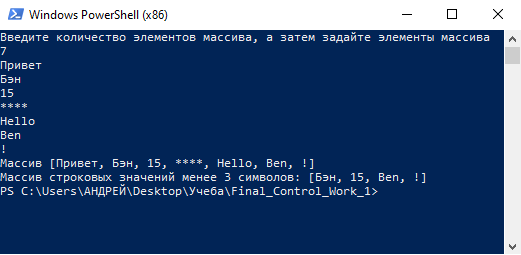

# **Итоговая контрольная работа по основному блоку**

## Описание проекта
Данная программа из имеющегося массива строк формирует новый массив из строк, длина которых меньше, либо равна 3 символам. Первоначальный массив вводится с клавиатуры. При решении используется исключительно массив.

## Инструкция по установке
Для установки проекта клонируйте репозиторий по активной ссылке с [GitHub](https://github.com/AndreyButusov/Final_Control_Work_1/tree/main) в нужную директорию на своем устройстве.

## Настройка и запуск проекта
После клонирования репозитория:
1. Откройте терминал
2. В поле ввода укажите путь к проекту
3. Наберите команду *dotnet run*
4. Выполните команды, запрашиваемые проектом в консоли

## Примеры работы проекта
**Пример ввода 7 строковых элементов различной длины**

## Описание вложенных методов
 * ``
 CreateMass(int CountStr)
 ``
  Создание массива определенной длины. Длина задается пользователем, как аргумент метода. Возвращаемое значение метода - заданный массив.

* ``
 CountSmallString(string[] str, int Len)
 ``
 Счетчик количества "коротких" значений в массиве. Первый аргументт метода - заданный массив. Второй аргумент метода - количество символов в элементе массива, по которому элементы массива будут отнесены к "коротким". Возвращаемое значение метода - количество элементов заданного массива, в которых количество сиволов меньше или равно второму аргументу.

 * ``
ChangeMass(string[] str, int Len)
 ``
Метод создания нового массива с элементами, длина которых менее "Len" символов. ервый аргументт метода - заданный массив. Второй аргумент метода - количество символов в элементе массива, по которому элементы массива будут отнесены к "коротким". Возвращаемое значение метода - новый массив, состоящий из элементов заданного массива, количество сиволов в которых меньше или равно второму аргументу.
**Внимание! В работу данного метода включена зависимость от метода CountSmallString.**

## Поддержка
Для получения обратной связи Вы можете написать мне на электронную почту
``
example@example.ru
 ``

## Обновление
Актуальную версию проекта можно найти по ссылке на [GitHub](https://github.com/AndreyButusov/Final_Control_Work_1/tree/main "Андрей Бутусов").